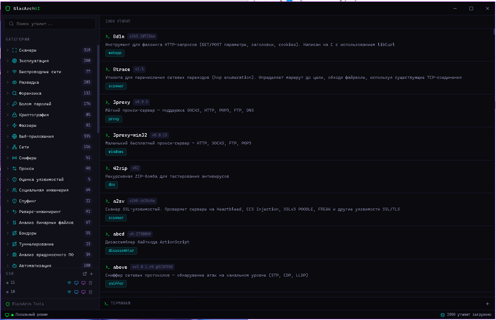
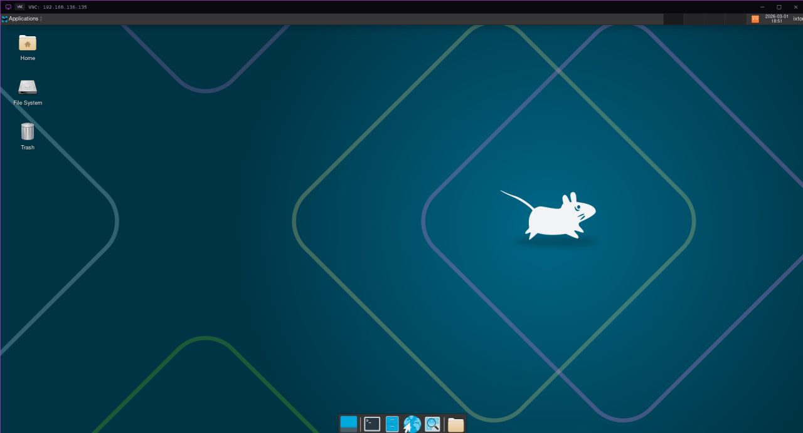
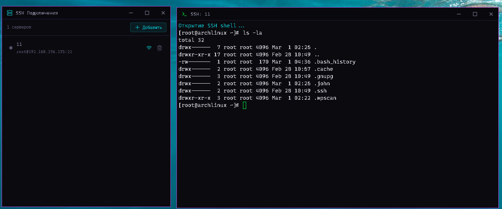
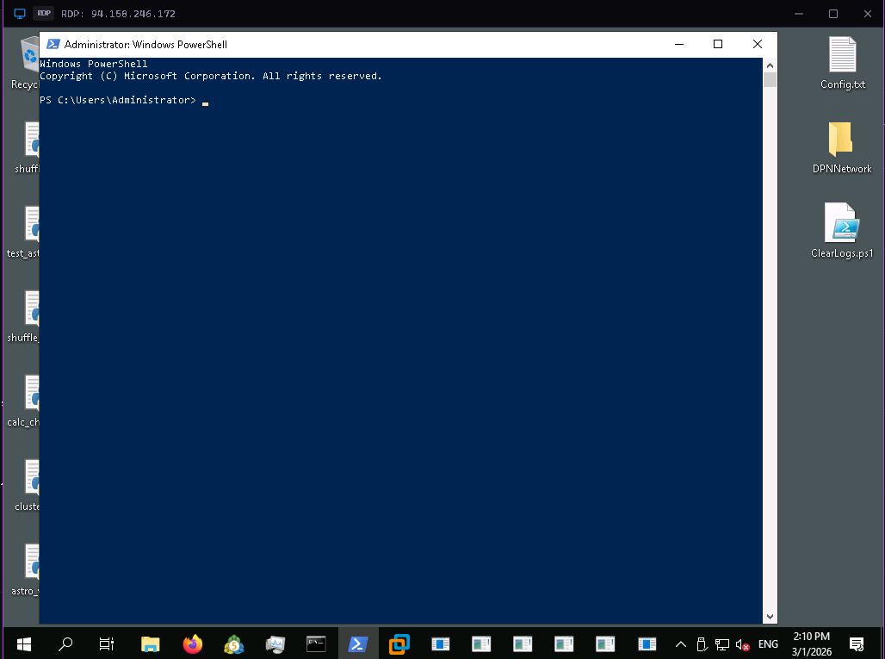

<p align="center">
  
</p>

<h1 align="center">BlacArchUI</h1>

<p align="center">
  <b>Графическая оболочка для утилит BlackArch Linux</b><br>
  Терминал, SSH, VNC, RDP — всё в одном Electron-приложении с тёмным интерфейсом.
</p>

<p align="center">
  
  
  
  
</p>

---

## О проекте

BlacArchUI — десктопное приложение для пентестеров и системных администраторов. Предоставляет единый интерфейс для работы с инструментами BlackArch, удалёнными серверами и терминалами.

### Возможности

- **Каталог инструментов** — поиск и запуск утилит BlackArch по категориям с нечётким поиском (Fuse.js)
- **Терминал** — встроенный эмулятор терминала на базе xterm.js с поддержкой нескольких вкладок и отдельных окон
- **SSH-клиент** — подключение к удалённым серверам, сохранение конфигураций, интерактивная оболочка
- **VNC-клиент** — удалённый рабочий стол через noVNC прямо в окне приложения, поддержка UnixLogon (тип 129), настраиваемое шифрование
- **RDP-клиент** — подключение к Windows-серверам через node-rdpjs, рендеринг bitmap на canvas
- **Тёмная тема** — единый дизайн в стиле BlackArch с кастомными titlebar'ами

<p align="center">
  
  </br>
  
  </br>
  
  </br>
</p>

## Требования

- **Node.js** >= 18
- **npm** >= 9
- **Git**
- **Windows 10/11**, **macOS** или **Linux**
- Для сборки нативных модулей (node-pty): Visual Studio Build Tools (Windows) или build-essential (Linux)

## Установка

```bash
# Клонировать репозиторий
git clone https://github.com/AkaTorich/BlacArchUI.git
cd BlacArchUI

# Установить зависимости (автоматически применяет патчи для noVNC и rdpjs)
npm install

# Запустить в режиме разработки
npm start
```

## Сборка

```bash
# Собрать установщик для текущей платформы
npm run make
```

Готовые установщики появятся в папке `out/make/`.

## Стек технологий

| Компонент | Технология |
|-----------|-----------|
| Платформа | Electron 40 |
| UI | React 19, TypeScript 5 |
| Сборка | Vite + Electron Forge |
| Терминал | xterm.js + node-pty |
| SSH | ssh2 |
| VNC | noVNC (WebSocket-прокси TCP↔WS) |
| RDP | node-rdpjs-2 (IPC bitmap→canvas) |
| Поиск | Fuse.js |
| Иконки | Lucide React |

## Структура проекта

```
BlacArchUI/
├── electron/               # Main process
│   ├── main.ts             # Точка входа, окна, IPC
│   ├── preload.ts          # Preload-скрипт (contextBridge)
│   ├── ipc-handlers.ts     # Обработчики IPC
│   └── services/
│       ├── pty-manager.ts      # Управление терминалами
│       ├── ssh-manager.ts      # SSH-подключения
│       ├── vnc-proxy.ts        # TCP↔WebSocket прокси для VNC
│       ├── rdp-manager.ts      # RDP-сессии (node-rdpjs)
│       ├── tool-database.ts    # База инструментов BlackArch
│       └── connection-store.ts # Хранение SSH-конфигураций
├── src/                    # Renderer process (React)
│   ├── App.tsx
│   ├── components/
│   │   ├── layout/         # TitleBar, Sidebar
│   │   ├── tools/          # Каталог инструментов
│   │   ├── terminal/       # Терминал (xterm.js)
│   │   ├── ssh/            # SSH-менеджер
│   │   ├── remote/         # VNC/RDP клиенты
│   │   └── common/         # Общие компоненты
│   └── types/              # TypeScript типы
├── scripts/
│   ├── patch-novnc.js      # Патч noVNC (top-level await, UnixLogon, securityFilter)
│   └── patch-rdpjs.js      # Патч node-rdpjs
└── package.json
```

## Лицензия

[MIT](LICENSE) — [ixTor]
